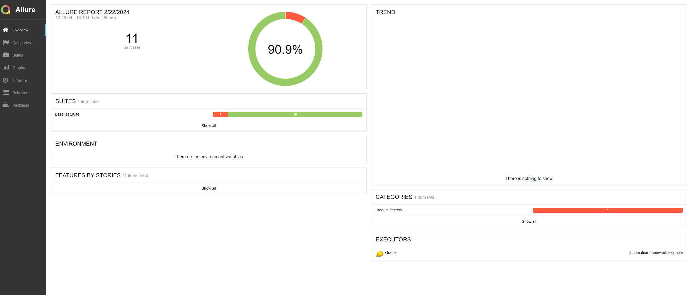

## Project Tech Stack
Java 17
Gradle
Spring 
TestNg

## Project Key Features

## Project Report

## Project Conventions

### [Meaningful Names](https://ashishmd.medium.com/summary-of-clean-code-by-robert-c-martin-part-2-meaningful-names-5b5baaa5b3c6)
- Use descriptive and meaningful names for variables, functions, classes, and modules.
- Avoid abbreviations, single-letter names, and ambiguous terms.

### [Function Length](https://medium.com/codex/should-functions-be-small-e76b45aa93f)
- Keep functions short and focused on a single task.
- Aim for functions that do one thing and do it well.

### [Indentation and Formatting](https://medium.com/nerd-for-tech/clean-code-formatting-source-code-structure-f3021575d79g)
- Follow a consistent indentation style (e.g., spaces or tabs).
- Use a readable and consistent formatting style throughout the project.

### [Comments](https://medium.com/codex/clean-code-comments-833e11a706dc)
- Write comments to explain the intent of the code where necessary.
- Prefer self-explanatory code over excessive comments.
- Avoid redundant or misleading comments.

### [Code Duplication](https://refactoring.guru/smells/duplicate-code)
- Eliminate redundancy by refactoring common code into reusable functions or modules.
- Strive for the DRY (Don't Repeat Yourself) principle.

### [Error Handling](https://medium.com/@himanshuganglani/clean-code-error-handling-d8562573d324#:~:text=Error%20handling%20is%20a%20critical,code%20is%20robust%20and%20maintainable.)
- Implement proper error handling mechanisms with meaningful error messages.
- Handle errors gracefully and fail early when necessary.

### [Single Responsibility Principle (SRP)](https://medium.com/javarevisited/mastering-the-single-responsibility-principle-a-guide-to-clean-code-89ac3b8335d1)
- Ensure each class or module has a single responsibility.
- Encapsulate one and only one behavior per class or module.

### [Open/Closed Principle (OCP)](https://medium.com/javarevisited/mastering-the-art-of-clean-code-how-to-apply-the-open-closed-principle-in-practice-811dc009eb3b#:~:text=Understanding%20the%20Open%2DClosed%20Principle&text=This%20means%20that%20when%20new,flexible%20and%20easier%20to%20maintain.)
- Design software entities to be open for extension but closed for modification.

### [Liskov Substitution Principle (LSP)](https://dev.to/oliverjumpertz/lsp-the-liskov-substitution-principle-2b1i)
- Guarantee that objects of a superclass can be replaced with objects of its subclass without affecting the program's correctness.

### [Interface Segregation Principle (ISP)]( https://medium.com/@ramdhas/4-interface-segregation-principle-isp-solid-principle-39e477bae2e3#:~:text=The%20Interface%20Segregation%20Principle%20(ISP,rather%20than%20large%2C%20monolithic%20ones. )
- Avoid imposing unnecessary dependencies by segregating interfaces based on client requirements.

### [Dependency Inversion Principle (DIP)](https://medium.com/@gabriellamedas/dip-the-dependency-inversion-principle-dbe0f784f3aa)
- Decouple high-level modules from low-level modules by depending on abstractions.
- Abstractions should not depend on details; details should depend on abstractions.
